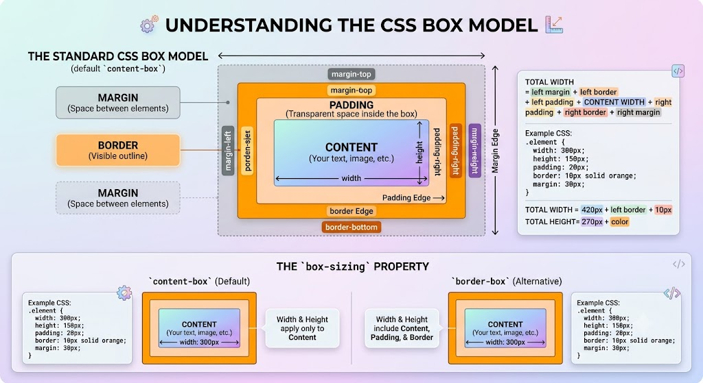

# CSS in Depth, 2nd edition

Most of the content in this repository (this file included) comes from [CSS In Depth, second edition](https://www.manning.com/books/css-in-depth-second-edition?a_aid=kjg&a_bid=a7bc24da) by Keith J. Grant.

```css
/* ruleset */
/* selector -> */ body {   /* declaration block */
  color: black;  /* <- declaration */
  font-family: Helvetica;
  font: font: 32px Helvetica, Arial, sans-serif; /* shorthand property */
}
```

- [CSS in Depth, 2nd edition](#css-in-depth-2nd-edition)
  - [Cascade, specificity, and inheritance](#cascade-specificity-and-inheritance)
    - [Special values](#special-values)
    - [Feature queries using @supports()](#feature-queries-using-supports)
  - [Working with relative units](#working-with-relative-units)
    - [Viewport-relative units](#viewport-relative-units)
    - [Unitless numbers and line-height](#unitless-numbers-and-line-height)
    - [CSS variables](#css-variables)
  - [Document flow and the box model](#document-flow-and-the-box-model)
    - [Logical properties](#logical-properties)
    - [The box model](#the-box-model)
      - [box-sizing property](#box-sizing-property)
    - [Element height](#element-height)
    - [Margin collapsing](#margin-collapsing)
    - [Spacing elements within a container](#spacing-elements-within-a-container)
    - [Resources](#resources)
- [Resources](#resources-1)

## Cascade, specificity, and inheritance

When declarations conflict, the cascade considers six criteria in the following order to resolve the difference:

1. <b>Stylesheet origin</b>: author styles vs user agent's default styles vs user styles (customizations added by the end user). Declarations marked !important are treated as a higher-priority origin. The overall order of preference, in decreasing order, is as follows:
   1. Important user-agent
   2. Important user
   3. Important author
   4. Normal author
   5. Normal user
   6. Normal user-agent
2. <b>Inline styles</b>: declaration is applied to an element via the HTML style attribute or a CSS selector. If the inline styles are marked as important, then nothing can override them
3. <b>Layer styles</b>: defined in layers, each with a different priority.
4. <b>Selector specificity</b>: selectors precedence, can be indicated with form `X.Y.Z`, where X is the number of IDs, Y the number of classes and Z the number of tags. Pseudo-class selectors (for example, `:hover`) and attribute selectors (for example, `[type="input"]`) each have the same specificity as a class selector. The universal selector (*) and combinators (>, +, ~) have no effect on specificity. See appendix A for more on these types of selectors. The exact rules of specificity are
   1. If a selector has more IDs, it wins
   2. If that results in a tie, the selector with the most classes wins.
   3. If that results in a tie, the selector with the most tag names wins.
5. <b>Scope proximity</b>: whether the styles are scoped to a portion of the DOM.
6. <b>Source order</b>: order in which styles are declared in the stylesheet. If you make the two conflicting selectors equal in specificity, then whichever appears last wins.

> [!NOTE]
> A **cascaded value** is a value for a particular property applied to an element as a result of the cascade. If an element has no cascaded value for a given property, it may **inherit** one from an ancestor element.
> Not all properties are inherited, primarily properties pertaining to text and lists.

### Special values

There are some special values that you can apply to any property to help manipulate the cascade: inherit, initial, unset, and revert.

* `inherit`: it will cause the element to inherit that value from its parent
* `initial`: every CSS property has an initial, or default, value. If you assign the value initial to that property, then it effectively resets to its default value. It's like a hard reset of that value.
* `unset`: when applied to an inherited property, it sets the value to inherit, and when applied to a noninherited property, it sets the value to initial.
* `revert`: override your previously set author styles but leave the user-agent styles intact

> [!NOTE]
> These keywords are normal cascaded values. That means it is still possible to override them with other values when another selector with higher specificity targets the same element.

### Feature queries using @supports()

You can use a feature query to provide a larger set of styles depending on whether or not the browser supports a given feature.

```css
@supports (display: grid) { ... }
```

If the browser understands the declaration (in this case, it supports grid), it applies any rulesets that appear between the braces. If it doesn't understand this, it will ignore them.
Feature queries may be constructed in a few other ways as well:

* `@supports not(<declaration>)`: Only apply rules in the feature query block if the queried declaration isn't supported.
* `@supports (<declaration>) or (<declaration>)`: apply rules if either queried declaration is supported.
* `@supports (<declaration>) and (<declaration>)`: Apply rules only if both queried declarations are supported.
* `@supports selector(<selector>)`: apply rules only if the given selector is understood by the browser (for example, @supports selector(:user-invalid)).

## Working with relative units

Length is the formal name for a CSS value that denotes a distance measurement. It's a number followed by a unit, such as 5px. Percentages are similar to lengths, but strictly speaking, they're not considered lengths.

* **pixels**: type of absolute unit. 1 in. = 25.4 mm = 101.6 Q = 2.54 cm = 6 pc = 72 pt = 96 px
* **em**: relative unit: 1 em means the font size of the current element; its exact value varies depending on the element you're applying it to. `font-size` ems are derived from the inherited font size.
* **rem**: short for "root em". Instead of being relative to the current element, rems are relative to the root element.

> [!NOTE]
> If you know the pixel-based font size you'd like but want to specify the declaration in ems, here's a simple formula: divide the desired pixel size by the parent (inherited) pixel size. For example, if you want a 10 px font and your element is inheriting a 12 px font, 10 / 12 = 0.8333 em.

👉 When in doubt, use rems for font size, pixels for borders, and either ems or rems for most other properties.

### Viewport-relative units

The **viewport** is the framed area in the browser window where the web page is visible. This excludes the browser's address bar, toolbars, and status bar, if present. The *large viewport* is the biggest possible viewport when all the browser's UX elements are hidden. The *small viewport* is the smallest possible viewport when all the UX elements are shown. The *dynamic viewport* behaves like small viewport when the viewport is small and like large viewport when the viewport is large.

The following are the four basic units that were first added to the language:

* `vh`: One percent of the viewport height
* `vw`: One percent of the viewport width
* `vmin`: One percent of the smaller dimension, height or width
* `vmax`: One percent of the larger dimension, height or width

For example, 50 vw is equal to half the width of the viewport, and 25 vh equals 25% of the viewport's height. Vmin is based on which of the two (height or width) is smaller. This is helpful for ensuring that an element will fit on the screen regardless of its orientation. Prepend the letter "l" to use large viewport units: lvw, lvh, lvmin, lvmax. Similarly, prepend the letter "s" to use small viewport units: svw, svh, svmin, svmax.
Prepend the letter "d" for dynamic viewport.

### Unitless numbers and line-height

* line-height (accepts both units and unitless values)
* z-index
* font-weight

A unitless 0 can be used only for length values and percentages, such as in paddings, borders, and widths.

> [!NOTE]
> When an element has a value defined using a length (px, em, rem, and so forth), its computed value is inherited by child elements.

### CSS variables

You can declare a variable and assign it a value; then you can reference this value throughout your stylesheet (DRY pattern). The name must begin with two hyphens (--) to distinguish it from other CSS properties, followed by whatever name you'd like to use. A function called `var()` allows the use of variables. This function also accepts a second argument as a fallback value.

```css
/* When a descendant element of the root uses the variables,
   these are the values they'll resolve to. */
:root {
  --main-font: Helvetica, Arial, sans-serif;
  --brand-color: #369;
}

p {
  font-family: var(--main-font, sans-serif);
  color: var(--secondary-color, blue);
}
```

> [!NOTE]
> If a var() function evaluates to an invalid value, the property will be set to its initial value.

## Document flow and the box model

> [!NOTE]
> Normal document flow refers to the default layout behavior of elements on the page. Inline elements flow
> along with the text of the page, from left to right, line wrapping when they reach the edge of their
> container. Block-level elements fall on individual lines, with a line break above and below.

Normal document flow is designed to work with a constrained width and an unlimited height. This means that the width of a parent element determines the width of its children, but for height, the opposite is true: the heights of child elements determine the height of the parent.

```css
/* double-container pattern: place your content inside two nested containers and
   set margins on the inner container to center it within the outer one
   auto left and right margins will grow to fill the available space,
   centering the element within the outer container. */
.container {
  max-width: var(--column-width);
  margin: 0 auto;
}
```

### Logical properties

Logical properties provide a way to work with elements in terms of their block and inline directions - which can change for different writing modes - rather than explicitly referring to top, right, bottom, and left or to width and height.


| horizontal writing mode | vertical writing mode   | Notes    |
| --- | ----- | --------------------- |
| width  | inline-size    | adapts to specify the height when used with vertical writing modes |
| height      | block-size  | adapts to specify a width in a vertical writing mode  |
| padding-left / right    | padding-inline-start / end |   |
| border-top / bottom     | border-block-start / end   |   |

Both classic properties and their equivalent logical properties can override each other in the cascade. This also helps an older approach used to style content for i18n, that is declaring the direction for the root node (then inherited by the children), and then provide all the styles for the different direction:

```css
.profile-card {
  margin-left: 20px;
  padding-right: 15px;
  border-left: 2px solid blue;
}

/* You then had to manually reverse EVERYTHING for RTL */
[dir="rtl"] .profile-card {
  margin-left: 0;           /* Reset the LTR margin */
  margin-right: 20px;       /* Apply the RTL margin */

  padding-right: 0;         /* Reset the LTR padding */
  padding-left: 15px;       /* Apply the RTL padding */

  border-left: none;        /* Reset the LTR border */
  border-right: 2px solid blue; /* Apply the RTL border */
}
```

could be replaced by:

```css
.profile-card {
  margin-inline-start: 20px;
  padding-inline-end: 15px;
  border-inline-start: 2px solid blue;
}
```

Nearly every CSS property that deals with vertical or horizontal values has a logical counterpart.

### The box model

> [!NOTE]
> The **box model** refers to the parts of an element (content, padding, border,
> and margin) and the size they contribute to their element. These produce
> rectangular boxes that are laid out by the browser on the page.

This behavior means that an element with a 300 px width, a 10 px padding, and a 1 px border has a rendered width of 322 px.



> [!NOTE]
> Top and bottom margins and paddings behave a little unusually on
> inline elements. They will still increase the height of the element, but
> they will not increase the height that the inline element contributes to
> its container; that height is derived from the inline element's line-height.
> Using display: inline-block will change this behavior if necessary.

Similar to a border, you can also add an **outline** to an element. This behaves much like a border but does not add to the element's size and is not part of the box model. It is placed outside the border, overlapping the margin. It will not change the size or position of the element, nor will it affect the page layout in any way.

* All four sides will always have the same outline style.
* You can manipulate the placement of an outline with the outline-offset property.

#### box-sizing property

By default, `box-sizing` is set to the value of `content-box`. This means that any height or width you specify sets the size of only the content box. With `border-box` the width, height, inline-size, and block-size properties set the combined size of the content, padding, and border.

```css
/* Universal border-box fix */
*,
::before,
::after {
  box-sizing: border-box;     #1
}
```

### Element height

it's best to avoid setting explicit height on elements, otherwise you run the risk of its contents overflowing the container. Overflowing content can be controlled with `overflow` property and its values:

* `visible`: content always visible, even when it overflows.
* `hidden`: overflowing content is clipped.
* `clip`: similar to hidden but programmatic scrolling is also disabled.
* `scroll`: scrollbars are visible (sometimes even if all content is visible)
* `auto`: scrollbars are added to the container only if the contents overflow.

You can control only horizontal overflow using the `overflow-x` property or vertical overflow with `overflow-y`.

For **percentage-based heights** to work, the parent must have an explicitly defined height. One place where percentage-based heights can be useful is when used for absolutely positioned elements, when you want to size them in relation to their container.
Instead of explicitly defining a height, you can use `min-height` and `max-height` to specify a minimum or maximum value, allowing the element to size naturally within those bounds.

### Margin collapsing

Margin collapsing means that when two vertical (top and bottom) margins touch each other, they do not add together. Instead, they merge together, and the larger of the two margins "wins". Example:

```css
.box-one {
  margin-bottom: 40px;
}

.box-two {
  margin-top: 25px;
}
```

```html
<!-- The gap between Box One and Box Two will be 40px, not 65px.
     The 25px margin essentially collapses inside the 40px margin. -->
<div class="box-one">Box One</div>
<div class="box-two">Box Two</div>
```

Three Important Things to Keep in Mind:
* It only happens vertically: Left and right margins never collapse. They will always add together.
* The biggest number wins: If you have a 50px margin touching a 10px margin, the final gap is 50px.
* Modern CSS often ignores it: If you use modern layout systems like CSS Flexbox or CSS Grid, margin collapsing is completely disabled. Margins inside a flex or grid container will always add together normally.
* Elements don't have to be adjacent siblings for their margins to collapse. Even if you wrap the paragraph inside an extra div, as in the following listing, the visual result will be the same. In the absence of any other CSS interfering, all the adjacent top and bottom margins will collapse.

### Spacing elements within a container

* Using an adjacent sibling combinator to apply a margin between elements. The same approach also works to apply a left margin between a series of inline or inline-block elements.

```css
.button-link + .button-link {
  margin-block-start: 1.5em;
}

/* or targeting any element that follows any other element */
.stack > * + * {
  margin-block-start: 1.5em;
}
```


### Resources

* [Logical properties on Mozilla docs](https://developer.mozilla.org/en-US/docs/Web/CSS/Guides/Logical_properties_and_values)


# Resources

* https://caniuse.com
* https://developer.mozilla.org/en-US/docs/Web/CSS
